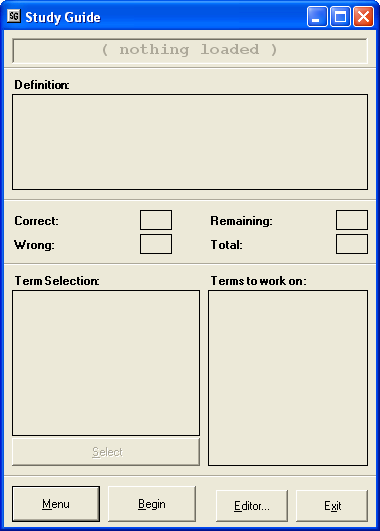
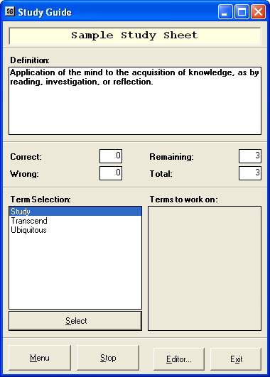
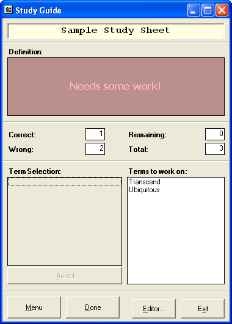
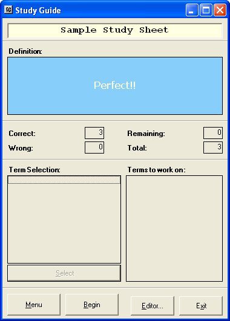
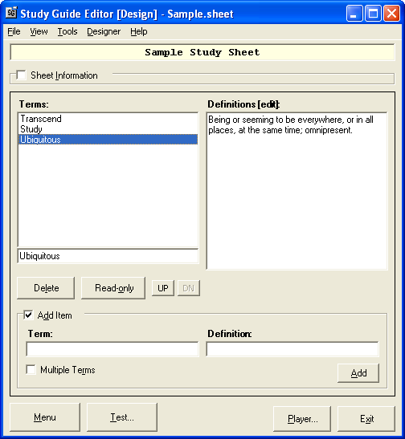

Study Guide
-----------

A program designed for students whose grades are not showing his or her best
ability on tests and quizzes. This program is a unique way of helping such
students to study and prepare for an upcomming exam.

Or more simply put: A fun, high-tech alternative to flash cards.

Usage
-----

Run the executable and click menu to open or create a new study sheet. Or run
the editor directly to create new or edit existing study sheets.

Screenshots
-----------

Study guide, without any sheets loaded yet. Click on 'Menu' to open a study sheet or create a new one.

The game in action. A definition is displayed and you have to match it with the correct term. Do you know which one it is?

All definitions have been matched, so the round is over. Looks like you got some wrong. Try again!

Nice job! Looks like your game playing, err, *studying* has paid off -- perfect score!

The editor, with the sample study sheet currently loaded. (The sample sheet is located in the same directory as the executable.)
